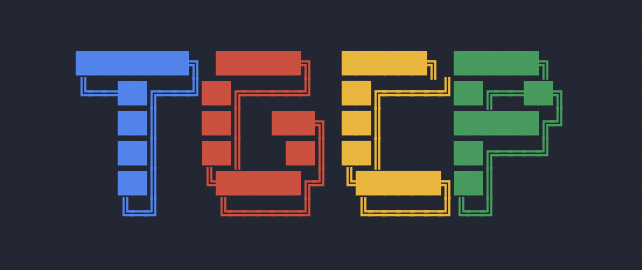

# TGCP (Terminal GCP Explorer)

TGCP is a terminal-based user interface for observing and managing Google Cloud Platform resources, inspired by tools like K9s and TAWS. It provides a fast, keyboard-driven experience for DevOps engineers and Cloud Administrators.



- **💡 Observability First**: Designed for reading statuses, logs, and configurations quickly.
- **🚀 Fast Navigation**: Global vim-style keybindings (`j/k`, `Shift+H/L`).
- **🔐 Secure Authentication**: Uses Application Default Credentials (ADC) - no new keys to manage.
- **⚡ Smart Caching**: Instant tab switching with background data refreshes.
- **🛠️ Service Support**:
    - **Compute**: GCE Instances (Manage power state, SSH), GKE Clusters (Launch k9s), Cloud Run, Cloud Functions.
    - **Data**: Cloud SQL, BigQuery, Bigtable, Spanner, Firestore, Redis.
    - **Storage**: GCS Buckets, Persistent Disks.
    - **Networking**: VPCs, Subnets.
    - **Analytics**: Pub/Sub, Dataflow, Dataproc.
- **🛡️ Safety**: Read-only by default for sensitive configs; confirmation dialogs for actions.
- **📚 Documentation**:
    - [Feature Deep Dive](docs/features.md)
    - [Developer Guide](docs/developer_guide.md)
    - [UI Patterns](docs/ui_patterns.md)

## Recommended Font

For the best experience, we recommend using [Google Sans Mono](https://fonts.google.com/specimen/Google+Sans+Mono) or a [Nerd Font](https://www.nerdfonts.com/) to ensure all glyphs and borders render correctly.

## Installation

### Prerequisites

- Go 1.21 or higher
- Google Cloud SDK (`gcloud`) installed

### Build from Source

```bash
git clone https://github.com/yogirk/tgcp.git
cd tgcp
go build -o tgcp ./cmd/tgcp
```

## Setup & Authentication

TGCP uses **Application Default Credentials (ADC)** to authenticate with Google Cloud.

1.  **Login with gcloud**:
    ```bash
    gcloud auth application-default login
    ```
2.  **Verify Project**:
    Ensure your default project is set in gcloud:
    ```bash
    gcloud config set project [YOUR_PROJECT_ID]
    ```

## Usage

Run the application:
```bash
./tgcp
```

### Configuration

TGCP supports a configuration file at `~/.tgcprc` (YAML format).

**Example `~/.tgcprc`:**
```yaml
project: "my-default-project"
ui:
  sidebar_visible: true
```

### CLI Options

| Flag | Description |
|------|-------------|
| `--project <ID>` | Override the default project ID for this session. |
| `--debug` | Enable verbose logging to `~/.tgcp/debug.log`. |
| `--version` | Display version information. |
| `--help` | Show help message. |

### Keybindings

#### Global
| Key | Action |
|-----|--------|
| `q` | Quit application or Go Back |
| `?` | Toggle Help overlay |
| `:` | Open Command Palette |
| `/` | Filter current list |
| `Ctrl+c` | Force Quit |

#### Navigation
| Key | Action |
|-----|--------|
| `↑` / `k` | Move selection up |
| `↓` / `j` | Move selection down |
| `Enter` | Select item / View Details |
| `Tab` | Toggle Sidebar visibility |

#### Service Actions
| Key | Action | Context |
|-----|--------|---------|
| `r` | **Refresh** data (bypassing cache) | Global |
| `s` | **Start** resource | GCE, Cloud SQL |
| `x` | **Stop** resource | GCE, Cloud SQL |
| `h` | **SSH** into instance | GCE |
| `K` | **Launch k9s** | GKE |
| `[` / `]` | **Switch Tabs** | Cloud Run (Services/Functions) |
| `Enter` | **Drill Down** / **Open** | GCS Object Browser, BigQuery |
| `Esc` | **Go Back** / **Up Level** | GCS Object Browser, BigQuery |

## Troubleshooting

### "Authentication Error" Screen
**Cause**: The application cannot find valid credentials.
**Fix**: Run `gcloud auth application-default login`. If that fails, ensure `GOOGLE_APPLICATION_CREDENTIALS` environment variable is pointing to a valid key file.

### "No Project ID"
**Cause**: The ADC credentials didn't contain a quota project, and no project was specified in flags.
**Fix**: Run `gcloud config set project <PROJECT_ID>` or run tgcp with `./tgcp --project <PROJECT_ID>`.

### API Errors (403, etc.)
**Cause**: Your credentials might not have permissions for the specific service (e.g., Compute Viewer).
**Fix**: Ensure your user account or service account has the necessary IAM roles.

## Development

- **Run in debug mode**: `go run ./cmd/tgcp --debug`
- **View logs**: `tail -f ~/.tgcp/debug.log`
- **Run tests**: `go test ./...`

## License

MIT
